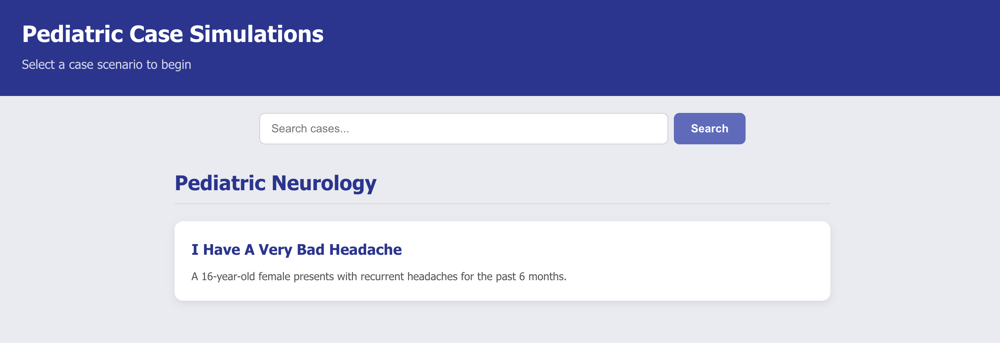
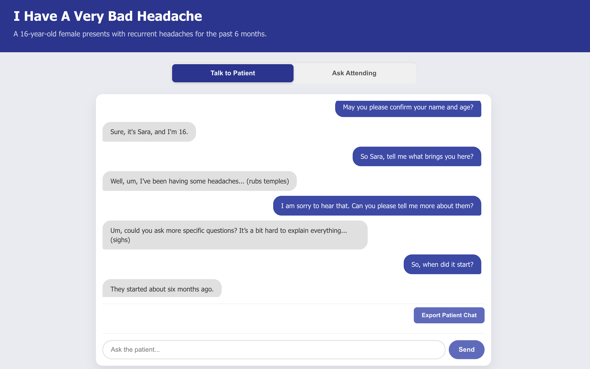

# TinyRounds: Pediatric Case Simulations

  A desktop application built with Electron, React (or your frontend framework), Node.js, and OpenAI, designed to simulate pediatric medical cases for educational purposes. This platform allows users to engage with simulated patient interactions and receive feedback from a virtual attending physician.

## Table of Contents

- [Features](#features)
- [Getting Started](#getting-started)
  - [Prerequisites](#prerequisites)
  - [Installation](#installation)
  - [Running the Application](#running-the-application)
- [Project Structure](#project-structure)
- [Contributing](#contributing)
- [License](#license)
- [Authors](#authors)

## Features

* **Interactive Patient Simulations:** Engage in conversational scenarios with AI-driven pediatric patients.
* **AI-Powered Feedback:** Receive real-time feedback and analysis from a virtual attending physician based on your history-taking performance.
* **RAG (Retrieval Augmented Generation):** Utilizes relevant case data (patient profiles, physician insights, teaching points) to enhance AI responses and provide accurate context.
* **Case Management:** Browse and select from a list of pediatric cases.
* **Cross-Platform Desktop Application:** Built with Electron for macOS, Windows, and Linux.

## Getting Started

Follow these instructions to get a copy of the project up and running on your local machine for development and testing purposes.

### Prerequisites

Before you begin, ensure you have the following installed:

* **Node.js**: (LTS version recommended) You can download it from [nodejs.org](https://nodejs.org/).
* **npm** (Node Package Manager): Comes with Node.js.
* **Git**: For cloning the repository.
* **An OpenAI API Key**: Required for the AI functionalities.

### Installation

1.  **Clone the repository:**
    ```bash
    git clone [https://github.com/mazen-alhammoud/tiny-rounds.git](https://github.com/mazen-alhammoud/tiny-rounds.git)
    cd tiny-rounds
    ```

2.  **Install dependencies:**
    Navigate to the project root and install both frontend and backend dependencies:
    ```bash
    npm install
    ```

3.  **Set up your OpenAI API Key:**
    Create a `.env` file in the root of your project directory (`tiny-rounds-demo/.env`).
    Add your OpenAI API key to this file:
    ```
    OPENAI_API_KEY="YOUR_OPENAI_API_KEY_HERE"
    ```
    **Important:** Do not commit your `.env` file to version control! It's already included in `.gitignore`.

### Running the Application

#### Development Mode:

To run the application in development mode (with developer tools accessible and live reloading):

```bash
npm start